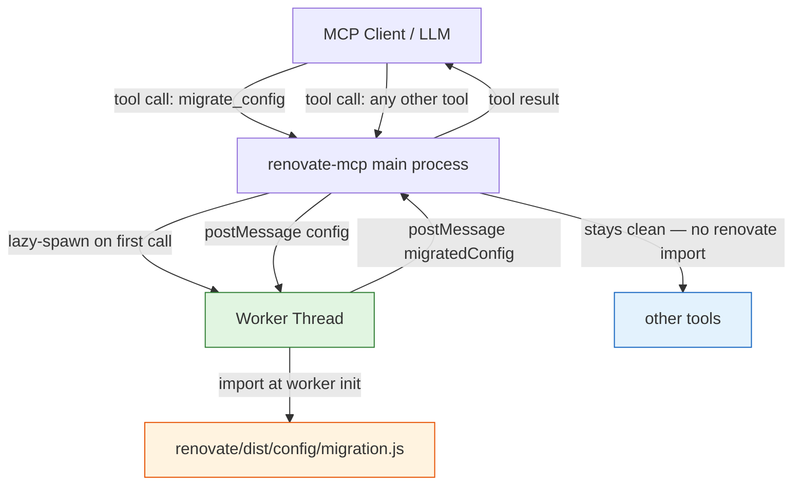

# 0001. Worker-isolated import of Renovate's migration library for `migrate_config`

**Date:** 2026-05-22

**Status:** Proposed

## Context

We are adding a `migrate_config` tool to renovate-mcp. Its purpose is to apply Renovate's built-in config migrations (deprecated key renames, template-variable rewrites, `packageRules` consolidation, `host-rules` unification, and ~100 other transformations) to a user-supplied config and return the migrated result.

Two constraints collide.

**Constraint 1 — the "no `renovate` import in `src/`" rule.** `CLAUDE.md` (Architecture section) states: *"Shell out to the Renovate CLI at runtime; never import `renovate` as a library in `src/`. … Importing `renovate` from `src/` is the wrong pattern — the whole runtime design hinges on staying decoupled from Renovate's API surface."* The rule exists so a Renovate version bump cannot break our runtime through an internal API change. Build-time scripts under `scripts/` are excepted (the preset catalogue uses this exception to produce a committed snapshot).

**Constraint 2 — Renovate has no `renovate-config-migrate` binary.** Renovate ships exactly two binaries: `renovate` and `renovate-config-validator` (per `node_modules/renovate/package.json#bin`). Migration is only exposed as a library: `renovate/dist/config/migration.js` exports a sync, pure function `migrateConfig(config) → { isMigrated, migratedConfig }`. The existing shell-out pattern in `src/lib/renovateCli.ts` has nothing to shell out to.

A lint-only alternative (catch deprecated keys in `lint_config` and tell the user the replacement) was considered. Analysis of Renovate's migration registry shows it would cover ~40-45% of cases: simple key renames and basic value coercions. The remaining ~55-60% — `packageRules` matcher consolidation (merging `matchDepPrefixes`, `matchDepPatterns`, `excludeDepNames` into a single `matchDepNames` with prefix/negation syntax), `dep-types` flattening into rules, `host-rules` unification across 5+ legacy fields — are structural transformations users cannot reasonably fix by hand without internal schema knowledge. Lint-only leaves the most valuable migrations on the table.

A direct runtime import in the main MCP server process was also considered but rejected: `migration.js` transitively imports `getOptions()`, which has top-level side effects loading the entire manager registry (~6.1 MB on disk, ~20-30 MB resident). Paying that cost on every server start — for a tool most sessions will never invoke — is unacceptable.

There is a relevant precedent in the codebase. `src/lib/customManagerPreview.ts` runs user-supplied regex inside a `node:worker_threads` worker (see the `Worker` import and `runWorker` helper) to isolate pathological matches and enforce timeouts. The worker is a deliberate sandbox between the main server process and untrusted/expensive code.

## Considered Options

### Option 1: Direct runtime import in the main server process

Import `renovate/dist/config/migration.js` from `src/tools/migrateConfig.ts` (lazy-loaded on first call).

**Pros:**
- Smallest amount of code.
- Exact Renovate behavior, no reimplementation drift.

**Cons:**
- Violates the "no `renovate` import in `src/`" rule directly, with no structural isolation.
- The lazy load still imports `getOptions()` into the main process forever; subsequent requests carry the ~20-30 MB resident cost.
- A breaking change in `getOptions()`'s top-level initialization (e.g. a new manager that fails to register) takes down the *whole MCP server*, not just `migrate_config`.

### Option 2: Worker-thread isolation (chosen)

Spawn a `node:worker_threads` worker the first time `migrate_config` is called. The worker imports `renovate/dist/config/migration.js`, receives a config via `postMessage`, and returns `{ isMigrated, migratedConfig }`. The main process never imports `renovate`.

**Pros:**
- Memory and startup cost are contained in a subprocess that can be terminated.
- A Renovate internal API change that crashes the import only kills the worker — the main MCP server stays up and other tools keep working.
- Reuses an established pattern (`customManagerPreview.ts`) — readers of `src/` already understand worker isolation here.
- The rule "no `renovate` import in `src/`" survives in spirit: the main server process still has no direct coupling to Renovate's API surface. The worker is a sandbox boundary analogous to a child process.

**Cons:**
- More moving parts than a direct import: worker lifecycle, message serialization, error propagation across the thread boundary.
- First-call latency is higher (worker startup + Renovate module graph cold-load) — likely 1-3 seconds. Acceptable for an interactive design workflow.
- Adds a second runtime context that needs to be kept in sync if migration-related shapes change.

### Option 3: Lint-only — drop `migrate_config`, expand `lint_config` instead

Add a deprecated-key lint rule to `lint_config` that flags old keys and suggests replacements. Don't apply migrations.

**Pros:**
- Zero architectural compromise — no `renovate` import anywhere in `src/`.
- Smallest implementation.

**Cons:**
- Covers only ~40-45% of what real migration does. Structural transformations (the highest-value cases) require automation users can't reasonably perform by hand.
- Forces users to context-switch out of the MCP workflow to actually fix non-trivial deprecations.

### Option 4: Spawn `renovate --print-config` and diff

Shell out to the full Renovate binary against the user's repo and read the printed (migrated + resolved) config. Diff against the input to isolate migration changes.

**Pros:**
- Stays within the existing shell-out pattern. No `renovate` import anywhere.

**Cons:**
- Heavyweight: spins up full Renovate, expands `extends`, may do network I/O.
- Couples migration to resolution — the output is the *resolved* config, not just the migrated one. Isolating "what migration changed" requires a non-trivial diff.
- Wrong shape for an interactive design tool.

## Decision

**We will use Option 2 (worker-thread isolation).**

The deciding factors:

1. **Lint-only (Option 3) leaves too much value on the table.** The analysis showed that the highest-value migrations are exactly the ones lint cannot suggest as a simple text fix. Shipping a half-tool is worse than shipping a properly scoped one.

2. **The "no `renovate` import in `src/`" rule is upheld in substance.** Its purpose is to prevent the main runtime from coupling to Renovate's internal API. A worker thread is a sandbox boundary — structurally equivalent to a child process for isolation purposes. The main MCP server process still has zero direct `import 'renovate/…'` statements.

3. **The pattern is already in the codebase.** `customManagerPreview.ts` establishes worker-thread isolation as a recognized tool in this project. We are not introducing a new architectural concept; we are reusing one.

4. **The cost profile is right.** Memory/startup costs occur only when `migrate_config` is actually invoked, and they live in a subprocess that can be killed. Server startup stays clean.

Options 1 and 4 fail the architectural-isolation test. Option 3 fails the user-value test.

`CLAUDE.md` (Architecture section) will be updated to document this carve-out so the rule remains accurate as written. The carve-out is narrow: *worker-thread isolated, no direct main-process import*. Any future tool wanting to import `renovate` from `src/` outside a worker still requires its own ADR.

## Consequences

**Easier:**
- `migrate_config` ships with full Renovate-fidelity behavior instead of a partial reimplementation.
- The pattern (worker spawns library code, main process stays clean) becomes a documented option for future tools that face the same shape (e.g. if we ever want to surface other Renovate internals like the option catalogue or schedule parser).
- A breaking change in Renovate's internal migration API degrades to a clear, isolated failure (`migrate_config` returns an error) rather than cascading into the whole server.

**Harder:**
- Worker-lifecycle management is new code surface: spawn-on-demand, message serialization, timeout, termination, error propagation across the thread boundary. Mitigated by following the existing `customManagerPreview.ts` shape.
- First-call latency on `migrate_config` (~1-3 s) is higher than other tools. Acceptable trade for an interactive design workflow; will be documented in the tool description.
- The `renovate` package needs to be a *runtime* dependency (already true — `node_modules/renovate` ships with the published renovate-mcp; the bundled binary exception in CLAUDE.md already covers this).
- A Renovate version bump can now break `migrate_config` semantically without a CLI surface change. Mitigation: integration tests against the real `renovate/dist/config/migration.js` (the nightly CI work proposed in issue draft #9 covers this).

**Tradeoffs accepted:**
- Slight rule-erosion: future contributors may cite this ADR to justify other worker-isolated imports. We accept that — each such case still requires its own ADR explaining why a worker is the right boundary.

**Follow-ups created by this decision:**
- Implement `src/lib/migrationWorker.ts` (or equivalent) following the `customManagerPreview.ts` shape.
- Implement `src/tools/migrateConfig.ts` and wire into `src/index.ts`.
- Update `CLAUDE.md` Architecture section: amend the "never import `renovate` as a library in `src/`" sentence to note the worker-isolation exception with a link to this ADR.
- Integration test that drives `migrate_config` through `test/helpers/mcpSession.ts` with a config containing a deprecated key (e.g. `masterIssue`) and asserts the migrated output.
- README: add `migrate_config` row to the tool table; update intro tool count from eleven to twelve; mention the worker model in "Design notes".

## Diagram

