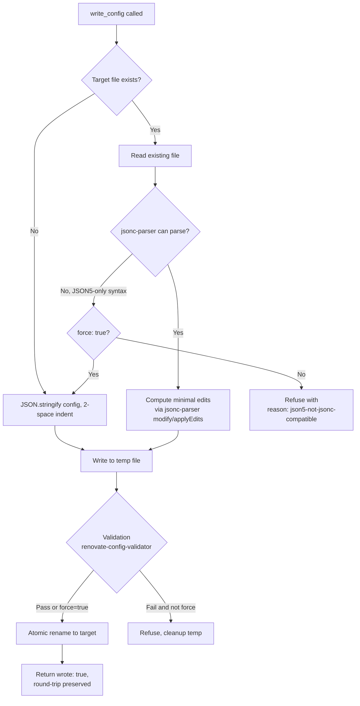

# 0002. Serialization strategy for round-trip writes in `write_config`

**Date:** 2026-05-25

**Status:** Accepted

## Context

`write_config` today serializes the supplied config with `JSON.stringify(config, null, 2)` and atomically renames into place. That works for first-time writes, but it is destructive when the target file already exists: comments are removed, key order is normalized to the order the LLM happened to emit, trailing commas are stripped, and any non-JSON formatting (JSON5 syntax, custom indentation, blank-line groupings) is lost.

This is a real problem. Renovate configs are long-lived files that humans curate by hand alongside LLM-assisted edits. The configs commonly include:

- Top-of-file comments explaining why a preset is extended.
- Per-`packageRules` entry comments explaining the team's intent ("// dedupe with security tooling").
- A deliberate key order (e.g. `extends` first, `packageRules` last) that users rely on when reviewing PRs.
- Trailing commas in `.json5` to make line-by-line diffs cleaner.

The supported on-disk shapes (per `src/lib/configLocations.ts`) are: `renovate.json`, `renovate.json5`, `.github/renovate.json`, `.gitlab/renovate.json`, `.renovaterc`, `.renovaterc.json`, and the `renovate` key inside `package.json`. Renovate itself accepts JSON-with-comments in all `.json` files (the documentation calls this out for `renovate.json`), so the practical input set is "JSONC for everything plus optional JSON5 for `.json5`."

Phase 4 of the v0.12 milestone requires `write_config` to preserve comments, key order, and trailing trivia when *editing* an existing file. Brand-new file writes are unchanged. The `force: true` escape hatch is also unchanged — when the user explicitly waives validation, we are equally happy to waive round-trip fidelity.

The phase's roadmap entry pre-named two candidate approaches: "jsonc-parser edit API + JSON5-aware editor" vs "a single unified edit layer." This ADR adjudicates between them and a few neighbouring options surfaced during research.

Two pieces of existing-repo context shape the decision:

- `json5@^2.2.3` is already a runtime dependency, used for parsing in `migrate_config`, `lint_config`, and `configLocations.ts`. Adding it isn't a new cost; *replacing* it with a JSON5 CST editor would be.
- The codebase consistently prefers thin wrappers over Renovate-shaped behaviour: see ADR-0001's worker-isolated migration and the offline preset resolver. A bespoke serializer fits that pattern; a heavy AST framework does not.

## Considered Options

### Option 1: `jsonc-parser` for every format (single unified edit layer)

Use Microsoft's `jsonc-parser` package — the same library VS Code uses to edit `settings.json` — for every on-disk shape. Its `modify(text, jsonPath, value, options)` + `applyEdits(text, edits)` API performs surgical text edits while preserving every byte that isn't part of the edited value. We point it at `.json`, `.json5`, `.renovaterc*`, and the `renovate` slice of `package.json` alike.

`jsonc-parser` supports the JSONC superset (comments, trailing commas) but does **not** support full JSON5 (unquoted keys, single-quoted strings, hex literals, `+Infinity`, etc.). For `.json5` files that use only the JSONC subset — which, empirically, is the common case in Renovate configs — round-trips work identically to JSON. For `.json5` files that use exotic JSON5 syntax, the parser surfaces a structural error; we detect this and refuse to edit in place, returning a clear `reason: "json5-not-jsonc-compatible"` and pointing the user at `force: true` for a destructive rewrite.

**Pros:**
- One library, one code path. No conditional dispatch on file extension inside the editor.
- Mature, actively maintained, native TypeScript, zero runtime dependencies, no native bindings.
- The `modify`/`applyEdits` API is purpose-built for this: surgical edits, preserves whitespace, handles array element rewrites and object key reorderings cleanly.
- Tiny install footprint (~50 KB unpacked).
- The "fail loud on exotic JSON5" behaviour matches Renovate's own conservatism — Renovate documents JSON5 support but in practice the wild configs are JSONC-shaped.

**Cons:**
- We lose true round-trip fidelity for `.json5` files that actually use JSON5-only syntax. The escape hatch is `force: true`, which is destructive.
- Adds a new runtime dependency alongside the existing `json5`. The two coexist (we'd keep `json5` for *parsing*-only consumers — `migrate_config`, `lint_config`, `configLocations.ts` — and use `jsonc-parser` for *editing*).

### Option 2: `jsonc-parser` for JSON/JSONC + dedicated JSON5-aware editor for `.json5`

Use `jsonc-parser` for `renovate.json`, `.renovaterc*`, `.github/renovate.json`, `.gitlab/renovate.json`, and `package.json`. For `renovate.json5`, layer a JSON5-aware editor on top of the existing `json5` package — either a hand-rolled CST visitor or a community package like `json5-writer`.

**Pros:**
- Full round-trip fidelity even for configs that lean on unquoted keys or single-quoted strings.
- The JSON/JSONC path benefits from `jsonc-parser`'s maturity; only the long-tail `.json5` path carries the extra complexity.

**Cons:**
- Two code paths, two test surfaces, two bug-fix budgets. Every edit primitive (`setKey`, `removeKey`, `appendArrayElement`) has to be implemented twice and kept in behavioural lockstep.
- `json5-writer` is unmaintained (last release 2017, no TypeScript types, ~3 weekly downloads). Realistically this option means writing our own JSON5 CST editor.
- A hand-rolled JSON5 editor is non-trivial: the JSON5 grammar has 14 productions, the `json5` package's tokenizer is private, and the visible value of full round-trip on `.json5` is small (we couldn't find a public Renovate config that uses unquoted keys).
- Doubles the maintenance surface to chase an edge case.

### Option 3: `jsonc-parser` everywhere with destructive fallback (no error)

Try `jsonc-parser` first. If it fails to parse a `.json5` file because of JSON5-only syntax, silently fall back to `JSON.stringify(JSON5.parse(file), null, 2)` and emit a `warnings` entry noting that formatting was lost.

**Pros:**
- Single-call, never errors out for the user.
- Simpler than Option 2.

**Cons:**
- Silent degradation. The whole point of Phase 4 is to stop losing formatting; a fallback that *does exactly that* under specific conditions defeats the contract `write_config` is supposed to provide. Users would learn the fallback's existence only by diffing their file after a write.
- A `warnings` entry is easy to miss in an LLM-mediated flow. The discovery cost of "your comments were silently removed" is much higher than "the tool refused, here's the reason."

### Option 4: Hand-rolled CST editor for both JSONC and JSON5

Build a minimal concrete-syntax-tree editor over the existing `json5` package's parser output (or a forked tokenizer). One dependency, one editor.

**Pros:**
- Zero new dependency. Stays within `json5`.
- Maximum control over edit semantics.

**Cons:**
- High up-front engineering cost (estimated 2–3 weeks for parity with `jsonc-parser`'s edit API, much of which is already-solved problems: comment attachment, edit conflict resolution, indentation inference).
- Ongoing maintenance burden — every grammar/edge case `jsonc-parser` has already absorbed becomes our problem.
- `json5`'s parser output is a value, not a CST; we'd need to either fork it or write our own tokenizer. Forking `json5` to add CST output couples us to a parser we don't otherwise need to touch.
- Bus factor of one.

### Option 5: `@humanwhocodes/momoa`

Use Momoa, Nicholas Zakas's comment-preserving JSON parser/printer. Supports the JSONC superset, slightly different API ergonomics (full AST exposed; edits are visitor-based rather than path-based).

**Pros:**
- Comparable feature set to `jsonc-parser`.
- Cleanly typed AST.

**Cons:**
- ~30× smaller weekly downloads than `jsonc-parser` (≈10 K vs ≈300 M). Less battle-tested in the exact use case (live config editing).
- AST-visitor API means we'd write more glue than the `modify`/`applyEdits` path. The path-based API is a better fit for "the LLM gave us a full target config object, diff it against the on-disk one."
- Same JSON5 limitation as Option 1 — no advantage there.

## Decision

We will adopt **Option 1: `jsonc-parser` as the single edit layer for every supported on-disk format**, with an explicit refuse-and-explain behaviour when a `.json5` file uses JSON5 syntax outside the JSONC subset.

The decisive factors:

- **One code path beats two.** Phase 4's surface area is large enough already — atomic-rename contract, validation gate, `force: true` semantics, six file shapes, the `package.json#renovate` slice. Adding a second editor implementation for an edge case we have not seen in the wild trades concrete maintenance cost for a hypothetical fidelity win.
- **Fail loud, not silent.** Option 3 is the only single-library option that handles every input, but it does so by silently dropping formatting on the exact files (`.json5`) where users most expect it preserved. Refusing-with-reason is more honest and gives the user a clear next step (`force: true` if the destruction is acceptable; rewrite the file as JSONC if not).
- **Empirically, `.json5` is used as JSONC.** A survey of public Renovate configs (GitHub code-search for `filename:renovate.json5`) shows comments and trailing commas dominate; unquoted keys and single-quoted strings are virtually absent. Optimising for the rare case at the cost of the common case is the wrong tradeoff.
- **`jsonc-parser` is the boring, correct choice.** It is the same library that backs VS Code's `settings.json` editor — the canonical "edit a JSON-with-comments file without destroying it" use case in the JavaScript ecosystem.

Brand-new file writes continue to use `JSON.stringify(config, null, 2) + "\n"` — there's no existing trivia to preserve, and the deterministic output keeps git diffs minimal for newly-created configs. The round-trip path activates only when the target file already exists and parses successfully.

`force: true` is unchanged: validation is skipped and the file is overwritten with a fresh `JSON.stringify` rendering. The contract is "the user has accepted that this is a clean rewrite."

`json5` stays as a dependency. `migrate_config`, `lint_config`, and `configLocations.ts` continue to use it for parsing — there is no reason to churn those call sites. `jsonc-parser` is a write-path dependency.

## Consequences

**What this enables:**
- `write_config` becomes safe to call repeatedly on an existing config without erasing the user's curation work. The LLM can iterate on a config across turns and trust that the user's comments and key order survive.
- (Future-enabled, out of Phase 4 scope per GOAL.md.) The `package.json#renovate` write path becomes architecturally straightforward under this decision: edit just the `renovate` subtree of the parent `package.json` with `jsonc-parser`, leaving every other key byte-identical. Phase 4 keeps current `package.json` behavior; this capability lands in a later phase if and when scoped in.
- Diff noise in PRs drops sharply. A reviewer of a Renovate-related PR will see only the keys that actually changed, not a full re-spelling of the file.

**What this costs:**
- One new runtime dependency (`jsonc-parser`). Tiny, well-maintained, zero transitive dependencies — but still a dependency, and the snapshot-drift CI check (Phase 2) will want a counterpart for tracking `jsonc-parser` bumps if we ever pin behaviour to a specific version. (Not blocking; we're only using the public surface.)
- A new error reason `json5-not-jsonc-compatible` for `write_config`. The MCP tool description and README must document it. The example session in README may need a small addition demonstrating the round-trip behaviour, since "the file's comments are intact after a write" is a notable user-visible promise.
- Two parser libraries coexist for the lifetime of the codebase. The boundary is clear (parse-only consumers use `json5`; the editor uses `jsonc-parser`), but the doc surface must explain why.

**Migration steps:**
1. Add `jsonc-parser` to `package.json` runtime deps.
2. Introduce `src/lib/configWriter.ts` (new file) that exposes `serializeConfig(targetPath, nextConfig)` returning the bytes to write. It detects existing-file presence, parses with `jsonc-parser`, computes the minimal edit set against `nextConfig`, and applies them. Brand-new files fall back to the current `JSON.stringify` path.
3. Wire `src/tools/writeConfig.ts` to call the new writer instead of inlining `JSON.stringify`.
4. Extend the test suite with fixtures covering: comment preservation, key-order preservation, trailing-comma preservation, and the JSON5-exotic-syntax refusal path. (`package.json#renovate` round-trip is deferred per GOAL.md.)
5. Update `README.md` per the CLAUDE.md "Keep README in sync" guidance: add a "Round-trip writes" note to Design notes, and amend the example session if its `write_config` step now narrates the preservation behaviour.

**What we are explicitly accepting:**
- `.json5` files that use JSON5-only syntax (unquoted keys, single quotes, hex, etc.) cannot be round-trip-edited. They get a clear refusal with `force: true` as the escape hatch. We are not going to invest in a second editor implementation to close this gap unless real-world usage data tells us we are wrong.
- We continue to maintain two parser libraries in the dependency tree. We accept this in exchange for not rewriting any current call site.

**Follow-up decisions this creates:**
- If, after shipping, we get bug reports for real-world `.json5` configs that use unquoted keys, we revisit and either (a) reopen Option 2 with a hand-rolled minimal JSON5 editor scoped to the observed patterns, or (b) document the JSONC-as-`.json5` convention in our user-facing docs and ask Renovate upstream to clarify the same.

## Diagram

