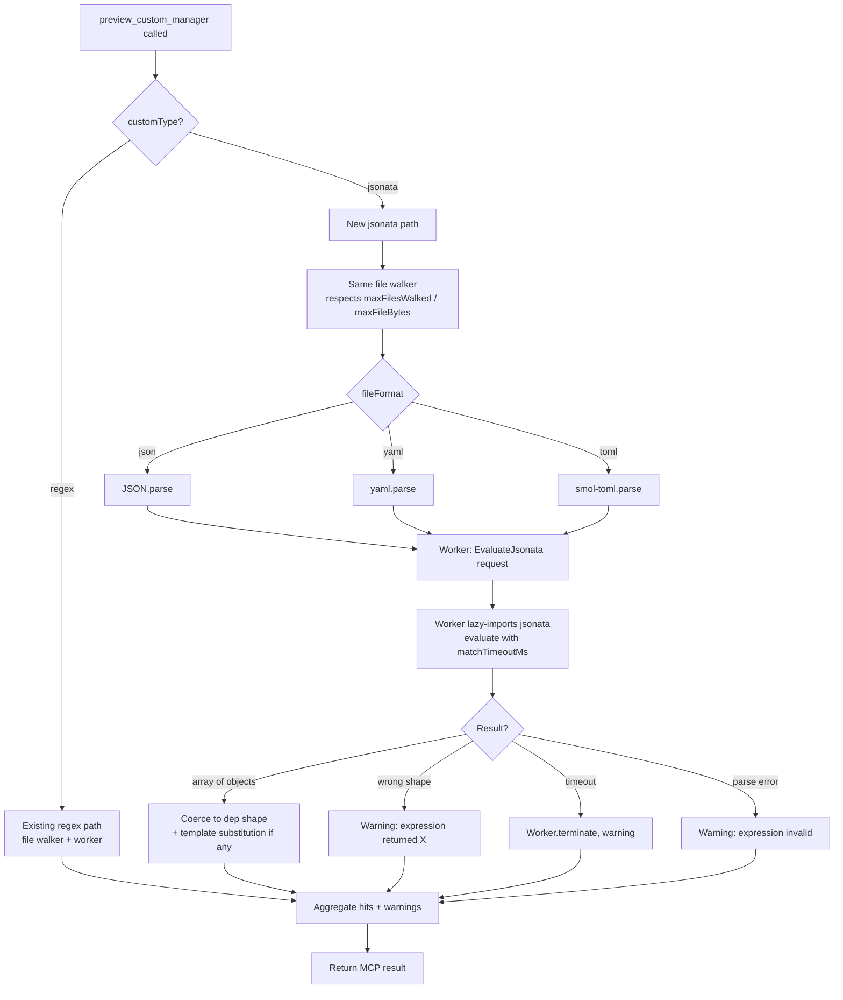

# 0003. JSONata customManager support in `preview_custom_manager`

**Date:** 2026-05-25

**Status:** Accepted

## Context

Phase 5 of the v0.12 milestone adds support for `customType: "jsonata"` to `preview_custom_manager`. Today the tool supports only `customType: "regex"`: `src/lib/customManagerPreview.ts` walks the repo, applies `fileMatch` regexes to relative paths, runs each `matchStrings` regex against file content inside a Node `worker_threads` worker, and surfaces per-line hits with extracted dep info.

Renovate added JSONata-based customManagers in late 2024 to handle structured config files (JSON, YAML, TOML) where regex extraction is brittle. The Renovate-side implementation lives at `node_modules/renovate/dist/modules/manager/custom/jsonata/index.js`:

1. Parse `content` into a JavaScript object using a parser selected by the manager's `fileFormat: "json" | "yaml" | "toml"` field.
2. For each `matchStrings` entry (a JSONata expression as a string), evaluate it against the parsed object via the `jsonata` npm package. Each expression must return an array of objects whose keys map to `depName`, `currentValue`, `datasource`, etc.
3. Apply optional `*Template` Handlebars fields to overlay or rename keys.
4. Return the union of resulting deps.

Three constraints shape our preview's design:

**Constraint 1 — interactive latency.** `preview_custom_manager` is the iterative-authoring tool. Users tweak an expression and re-invoke; round-trip latency dominates the experience. The regex path is already worker-isolated and pays the worker spawn cost on every invocation — that is the current ceiling, and JSONata cannot make it worse.

**Constraint 2 — the existing offline-and-native invariant.** Per `CLAUDE.md`'s Architecture section: *"`preview_custom_manager` is offline and native — does NOT shell out."* The tool runs untrusted user-supplied expressions and walks the working tree directly. JSONata must honor the same caps: `maxFilesWalked`, `matchTimeoutMs`, `maxFileBytes`. Pathological expressions (deep recursion, cartesian explosions over large JSON) must not hang the server.

**Constraint 3 — "no `renovate` import in `src/`."** Per ADR-0001 and the project-level rule in `CLAUDE.md`. JSONata fileFormat parsing depends on YAML and TOML parsers; Renovate uses `yaml` (the npm package) and `toml-eslint-parser`. We cannot reuse Renovate's wrappers at `node_modules/renovate/dist/util/yaml.js` / `toml.js` from runtime code — we'd be importing the `renovate` package transitively. We must add direct deps.

A scope fence from `.planning/phases/05-jsonata-custom-manager/GOAL.md` further narrows the design:

> **Out of scope:** YAML/TOML file-format parsing beyond what Renovate's customManager already exposes via `fileFormat`.

Read literally: we support exactly what Renovate's `fileFormat` field exposes (`json` / `yaml` / `toml`) and no more. We do not invent additional formats. We do not vendor a custom-format extension.

## Considered Options

The decision space has three axes that can be picked independently:

- **A. Add `jsonata` as a runtime dep, vs vendor/reimplement vs spawn an external process.**
- **B. Worker-thread isolation for JSONata evaluation, vs in-process with a timeout.**
- **C. YAML and TOML parser choice — match Renovate's libraries vs pick smaller alternatives.**

I treat each independently.

### Axis A — JSONata runtime

#### Option A1: Add `jsonata` npm package as a runtime dep, lazy-loaded

Add `jsonata ^2.x` to `dependencies`. Import it dynamically (`await import("jsonata")`) only the first time a JSONata customManager is previewed in a session, so sessions that never hit a JSONata manager don't pay the load cost.

**Pros:**
- Same library Renovate uses (pinned at `2.1.0` in Renovate's `package.json`), so parity tests have a fighting chance.
- ~50 KB minified, zero transitive deps, MIT, maintained by the JSONata project itself.
- Standard, predictable, well-typed.

**Cons:**
- One more runtime dep to track for the snapshot-drift check.

#### Option A2: Vendor / reimplement JSONata

Copy the parts of JSONata we need into `src/lib/jsonata-mini.ts` or hand-roll a minimal evaluator.

**Pros:**
- No new dep.

**Cons:**
- JSONata is a non-trivial query language (path expressions, predicates, joins, regex matchers, functions, lambdas). A "minimal" implementation that achieves parity is not minimal. Multi-week engineering cost; permanent divergence risk.
- Worst of all worlds: we'd be reinventing the upstream library Renovate uses, then chasing its bug fixes by hand.

#### Option A3: Shell out to Renovate

Reuse `renovateCli.ts` and call `renovate --dry-run` to evaluate a JSONata manager.

**Pros:**
- Full fidelity by definition.

**Cons:**
- Violates the explicit "`preview_custom_manager` is offline and native" invariant.
- Catastrophic latency cost — `dry_run` already takes seconds-to-minutes; the *preview* tool exists because users need iteration faster than that.
- Not a real option; included only to show it was considered.

### Axis B — JSONata evaluation isolation

#### Option B1: Worker-thread isolation (reuse the existing worker)

`customManagerPreview.ts` already runs regex evaluation inside a Node `worker_threads` worker via `runWorker` / `runMatchAllInWorker`. Extend the same worker to handle a new `EvaluateJsonata` request type. Pathological expressions are aborted via `worker.terminate()` after `matchTimeoutMs`, identical to how regex timeouts already work.

**Pros:**
- Reuses an existing, tested isolation pattern. The hard part — terminate-on-timeout — is already solved.
- Pathological JSONata expressions (e.g. deep recursion, cartesian explosions) are killable mid-flight. `jsonata` itself has no internal abort signal; only worker termination kills it cleanly.
- Latency parity with regex path: identical worker spawn cost is already amortized.

**Cons:**
- Slight code-organization complexity: the worker's `WorkerRequest` discriminated union grows a new variant; the lazy `import("jsonata")` happens *inside* the worker, not in the main process.
- The worker spawn cost (~30–50 ms cold) is paid even for "no jsonata managers found" — but it already is, for the regex path.

#### Option B2: In-process evaluation with a Promise timeout

Call `jsonata(expr).evaluate(json)` directly in the main process; race it against a `setTimeout` that rejects after `matchTimeoutMs`.

**Pros:**
- Simpler code path (no worker for jsonata).
- Lower per-call overhead.

**Cons:**
- **Timeout is unenforceable.** JavaScript Promises don't cancel. A `Promise.race` against a timer still leaves the inner JSONata evaluation running on the event loop, blocking I/O, until it eventually settles. Pathological expressions hang the MCP server even though the tool call returns. This violates Constraint 2.
- Diverges from the regex path's isolation guarantee — security-relevant inconsistency.

### Axis C — YAML and TOML parser choice

#### Option C1: Match Renovate's library set (`yaml` + `toml-eslint-parser`)

Use the same libraries Renovate uses internally. `yaml` is a popular, well-typed YAML 1.2 parser. `toml-eslint-parser` produces an AST that Renovate strips to a static value via `getStaticTOMLValue`.

**Pros:**
- Highest parity for fixtures lifted from Renovate's own test suite. Edge cases (TOML date types, YAML anchors, etc.) parse identically.

**Cons:**
- `toml-eslint-parser` is heavy (~250 KB) and exists primarily for ESLint integration. We don't need an AST; we need the parsed value.

#### Option C2: `yaml` + `smol-toml`

Same YAML library. Substitute `smol-toml` (compact, fast, native-value output, ~15 KB) for TOML.

**Pros:**
- Smaller install footprint.
- Returns JS objects directly, matching the JSONata input shape.

**Cons:**
- Slight risk of value-shape divergence from Renovate for TOML edge cases (date / time / datetime values, mixed-type arrays). Renovate's `toml-eslint-parser` + `getStaticTOMLValue` path normalizes these in a specific way; `smol-toml` may not match byte-for-byte.

#### Option C3: Match Renovate verbatim (`yaml` + `toml-eslint-parser` + their massage steps)

Like C1, but also reproduce Renovate's `massage` step (strip `{{...}}` template lines before parsing TOML, see `node_modules/renovate/dist/util/toml.js`). Renovate does this to handle TOML files with Handlebars templates injected; the parser would otherwise choke.

**Pros:**
- Maximum parity.

**Cons:**
- Pulls in TOML-specific behavior that may surprise users. The massage step is undocumented in Renovate's user-facing docs.

## Decision

We adopt **A1 + B1 + C2**: lazy-loaded `jsonata` npm dep, worker-thread isolation reusing the existing worker, and `yaml` + `smol-toml` for fileFormat parsing.

The decisive factors:

- **A1 over A2/A3:** Adding `jsonata` is the obvious choice. It's the same library Renovate uses, ~50 KB, zero transitive deps, and the lazy-load pattern (`await import("jsonata")`) gives us zero startup cost in sessions that never use it. A2 is multi-week reinvention work for a strictly worse outcome. A3 violates the offline-native invariant.
- **B1 over B2:** B2's timeout is unenforceable for the same reason JavaScript can't kill a running Promise — the user-supplied JSONata expression would continue executing past the timeout, blocking the MCP server's event loop. We already pay the worker spawn cost for the regex path; extending that worker with a new request variant is a tiny incremental change and gives us the only correct timeout semantic.
- **C2 over C1/C3:** Renovate uses `toml-eslint-parser` for AST-level introspection it doesn't actually need at the value layer; we have no such need. `smol-toml` is purpose-built for parsing TOML into JS values, which is exactly the JSONata input shape. The marginal divergence risk on TOML date types is acceptable for preview-tool fidelity — and parity tests will catch the cases that matter against Renovate's fixture corpus. The YAML choice is `yaml`, same as Renovate, because there's no smaller equivalent worth the parity risk.

**Templates.** Renovate's JSONata customManager supports `*Template` fields (Handlebars). Our regex preview supports only `{{groupName}}` substitution, deliberately. For Phase 5 we mirror the same limitation: `{{depName}}` / `{{currentValue}}` / `{{datasource}}` style template substitution only — full Handlebars stays out of scope. If the JSONata expression's returned objects already carry the right keys (which most published Renovate customManagers do), templates aren't needed; the LLM can suggest a key-shape that avoids templates. The README must document this gap clearly so users know to run `dry_run` for full-fidelity confirmation.

**Error parity.** The preview surfaces JSONata errors in the same shape the regex path uses today:

- JSONata expression compile-time errors → a `warnings` entry naming the expression and the parser's error message; no deps returned from that expression.
- JSONata evaluation timeouts → identical wording to the existing regex timeout warning, naming `matchTimeoutMs` as the dial.
- Output-shape mismatches (expression returns something that isn't an array of objects) → a warning explaining the expected shape and showing the actual `typeof` / sample of what came back.
- File-format parse failures (malformed YAML/TOML) → a per-file warning that names the file and the parser error; the file is skipped.

**Existing caps apply.** `maxFilesWalked`, `matchTimeoutMs`, `maxFileBytes` all apply to JSONata managers exactly as they do to regex managers. The walker is shared between paths; the worker timeout is shared.

**Regex path stays byte-identical.** The change is additive only. Snapshot tests on regex behavior must continue to pass without modification. This is the load-bearing invariant for Phase 5's "regex path unchanged" acceptance criterion.

## Consequences

**What this enables:**
- Users can iterate on JSONata customManagers in `preview_custom_manager` with the same fast feedback loop they have for regex managers — see file hits, see extracted deps, fix the expression, repeat.
- Parity tests against Renovate's own customManagers/jsonata fixture corpus become possible. The README can credibly say `preview_custom_manager` mirrors Renovate's JSONata behavior for the supported file formats.
- The CLAUDE.md "regex-only" sentence in the Architecture section flips to "regex and jsonata."

**What this costs:**
- Three new runtime dependencies: `jsonata`, `yaml`, `smol-toml`. Combined install footprint is small (~150 KB before transitive). All three are MIT, maintained, and stable.
- One new lazy-import indirection inside the worker.
- The snapshot-drift CI check (Phase 2) doesn't currently track these libraries, since they aren't `renovate`-generated snapshots. No action needed unless we later decide to pin behavior to a specific version of `jsonata` for exact parity with Renovate's pinned `2.1.0`. (Phase 5 plans should consider whether to pin `jsonata` exactly to Renovate's version.)
- Slightly larger install size. Acceptable for a tool whose value depends on parser fidelity.

**Migration steps:**
1. Add `jsonata`, `yaml`, `smol-toml` to `package.json` runtime deps. Document the rationale in a short comment next to each entry (or in the README's Design notes).
2. Extend the `customManagerPreview.ts` worker with an `EvaluateJsonata` request variant: receives `{ expression, json, timeoutMs }`, lazy-imports `jsonata`, evaluates, returns the result or an error.
3. Add a fileFormat parser dispatcher: a small `parseStructured(content, fileFormat)` helper that returns `{ ok: true, value } | { ok: false, error }`.
4. Add a `jsonata`-customType branch in the main flow alongside the existing `regex` branch. Reuses the file walker.
5. Lift fixtures from Renovate's `customManagers/jsonata` test suite at `node_modules/renovate/lib/modules/manager/custom/jsonata/__fixtures__` (build-time copy under `test/fixtures/jsonata/`, with a header noting origin). Parity tests assert same input → same dep extraction.
6. Update `README.md`: `preview_custom_manager` tool-table row mentions `customType: "jsonata"`; Design notes add a JSONata bullet covering supported `fileFormat` values, the Handlebars-template limitation, and the "run `dry_run` for full-fidelity confirmation" guidance.
7. Update `CLAUDE.md`: the "regex-only" sentence becomes "regex and jsonata"; note that `jsonata`, `yaml`, and `smol-toml` are preview-path-only deps; record the worker-isolation invariant for JSONata evaluation.

**What we are explicitly accepting:**
- Marginal divergence risk on TOML edge cases (date / time / datetime types) vs Renovate's `toml-eslint-parser` path. Parity tests will catch the cases users actually hit; we revisit if a real divergence shows up.
- The Handlebars-template gap. JSONata expressions whose returned objects don't already carry the right keys, and which rely on `*Template` Handlebars rewrites, won't preview faithfully. The README's "run `dry_run` afterwards" advice covers this honestly. Closing the gap is a separate decision (the custom manager authoring helper idea from PLAN.md), not a Phase 5 task.
- Three new runtime deps. We accept the install-size cost for fidelity.

**Follow-up decisions this creates:**
- If parity tests reveal TOML divergence we care about, revisit Axis C — either switch to `toml-eslint-parser` (Option C1) or vendor Renovate's specific `massage` + `getStaticTOMLValue` path.
- A future ADR may scope full Handlebars-template support — separately from this phase, separately from this ADR.

## Diagram

