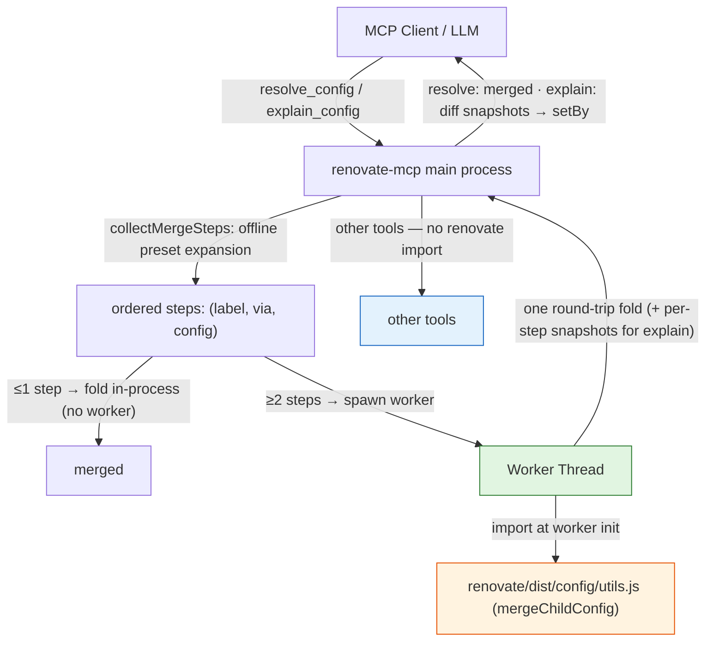

# 0004. Worker-isolated faithful config merge for `resolve_config` and `explain_config`

**Date:** 2026-05-30

**Status:** Accepted

## Context

`resolve_config` (expand `extends` presets into the final config) and `explain_config` (annotate each leaf with the preset chain that set it) both previously merged configs with a **hand-rolled approximation**: concatenate *all* arrays, recurse plain objects, scalars overwrite. The tools advertised this honestly (`mergeQuality: "preview"` plus a disclaimer pointing at `dry_run`).

For the v1.0 "close the caveats" milestone we want this merge to be **faithful** — bit-accurate to Renovate's own behavior — and we want `resolve_config` and `explain_config` to be **mutually consistent** (their resolved values must agree). Two constraints collide, exactly as in ADR-0001.

**Constraint 1 — the "no `renovate` import in `src/`" rule.** `CLAUDE.md` forbids importing `renovate` as a library from the main server process; the runtime stays decoupled from Renovate's internal API surface so a version bump can't break us through an internal change.

**Constraint 2 — the real merge has no CLI surface.** Renovate ships only `renovate` and `renovate-config-validator` binaries. The faithful merge is a library export: `renovate/dist/config/utils.js` exports `mergeChildConfig(parent, child)`. It does *not* concatenate all arrays — it concatenates only arrays whose option is `mergeable` in `getOptions()` (e.g. `packageRules`, `hostRules`, `addLabels`, `matchPackageNames`) and **overwrites** non-mergeable arrays (e.g. `assignees`, `reviewers`, `labels`, `schedule`); `constraints` is object-merged; mergeable objects recurse; `config.force` is spread last. Replicating that faithfully by hand means re-deriving the mergeable-option set and the special cases — which lives in Renovate's `getOptions()` and drifts across versions.

**The cost.** `mergeChildConfig` calls `getOptions()`, which loads the entire manager registry (~20-30 MB resident). Paying that on every server start — or worse, in the main process forever — is unacceptable for two tools that many sessions invoke repeatedly.

**The provenance entanglement.** `explain_config`'s per-field `setBy` provenance was produced by a *parallel* annotated merge (`mergeAnnotated`) that re-implemented the approximate semantics while threading contributions through. Making it faithful by re-implementing the *faithful* semantics inside the annotator would re-introduce exactly the coupling the rule forbids — and would risk `explain_config` and `resolve_config` drifting apart.

There is direct precedent: **ADR-0001** isolates `migrate_config`'s `renovate/dist/config/migration.js` import inside a `node:worker_threads` worker; `customManagerPreview.ts` does the same for user regex/JSONata. The worker is a sandbox boundary between the main process and expensive library code.

## Considered Options

### Option 1: Reimplement faithful `mergeChildConfig` in-process

Port Renovate's merge (mergeable-by-option, `constraints`, `force`, `vulnerabilitySeverity`) into `src/`, reading a committed snapshot of which options are mergeable.

**Pros:** stays offline and instant; no worker; no cold start.

**Cons:** re-derives Renovate's internal merge semantics in our own code — the precise coupling the "no `renovate` import" rule exists to prevent. The mergeable-option set and special cases would have to be snapshotted and kept in lockstep with every Renovate bump; silent drift would produce subtly-wrong "faithful" output, the worst failure mode.

### Option 2: Worker-isolated `mergeChildConfig` + diff-based provenance (chosen)

The main process flattens preset expansion **offline** (shared `collectMergeSteps`) into an ordered list of `(label, via, config)` steps, then ships the configs to a worker that folds them with the real `mergeChildConfig` in **one round-trip**. `resolve_config` takes the merged result. `explain_config` requests cumulative per-step snapshots and reconstructs `setBy` by **diffing** each step's before/after — no parallel merge.

**Pros:**
- Faithful by construction (it *is* Renovate's function).
- `resolve_config` and `explain_config` fold the identical steps through the identical worker, so they cannot disagree — the cross-check test now guards real consistency.
- Memory/cold-load cost is contained in a terminable subprocess; the main process never imports `renovate`.
- Reuses the established ADR-0001 worker pattern.
- A single round-trip per call amortizes the cold start; the ≤1-step fast path skips the worker entirely for the common no-extends / single-preset cases.

**Cons:**
- More moving parts: worker lifecycle, message serialization, the diff-attribution algorithm.
- First-call latency (~1-3 s cold-load) on configs that actually merge ≥2 sources.
- Merge semantics are now version-coupled to the installed Renovate.

### Option 3: Shell out to `renovate --print-config`

Run the full Renovate binary and read the printed resolved config.

**Pros:** stays within the shell-out pattern; no `renovate` import.

**Cons:** heavyweight, network I/O, couples merge to full resolution — the wrong shape for an interactive offline tool. Same rejection as ADR-0001's Option 4.

### Option 4: Keep the approximate merge, only re-frame the disclaimer

**Pros:** no work, no cold start.

**Cons:** doesn't close the caveat — the explicit goal of this milestone. Rejected by the milestone's framing.

## Decision

**We will use Option 2 (worker-isolated faithful merge + diff-based attribution).**

Deciding factors:

1. **It is the only option that closes the caveat without violating the isolation rule.** Option 1 re-derives Renovate internals in `src/` (the coupling we forbid); Option 2 keeps the main process free of any `renovate` import — the worker is the sandbox boundary, exactly as in ADR-0001.
2. **Consistency falls out for free.** A single shared `collectMergeSteps` feeds one fold; `resolve_config` and `explain_config` are the same computation viewed two ways. Left-folding the flattened steps is equivalent to the nested merge because `mergeChildConfig` is left-associative at every key type — a property pinned by a unit test.
3. **Provenance survives without a parallel merge.** Diffing the faithful merge's per-step snapshots attributes each leaf change to the contributing preset; final values are read from the merged result, so stripped `explanation` values equal `resolve_config`'s output by construction.
4. **The cost profile is acceptable and bounded.** Cold-load happens only when a config actually merges ≥2 sources, lives in a terminable worker, and a graceful fallback to the in-process approximate merge (reporting `mergeQuality: "preview"`) keeps these previously-offline-instant tools resilient if the worker is unavailable.

The worker's stdio is isolated (`stdout`/`stderr` captured, not piped to the parent) so Renovate's logger can never leak onto the MCP server's stdout JSON-RPC channel.

This narrows the ADR-0001 carve-out further: a **second** worker-isolated `renovate` import now exists. The rule survives in substance (the main process still has zero `import 'renovate/…'`), and any future such tool still needs its own ADR.

## Consequences

**Easier:**
- `resolve_config` / `explain_config` produce Renovate-faithful output (mergeable arrays concat, non-mergeable arrays overwrite, objects recurse, `constraints` object-merge, `force` last).
- The two tools are provably consistent (shared steps + identical fold), and `explain_config`'s attributor no longer maintains a parallel merge implementation.

**Harder:**
- First-call latency (~1-3 s) on multi-source merges. Mitigated by the ≤1-step in-process fast path, the single round-trip, the graceful fallback, and a 30 s timeout.
- Merge semantics are now version-coupled to the installed Renovate. Mitigated by a **mergeable-array drift sentinel** unit test (asserts a representative set of mergeable vs non-mergeable keys, failing loudly in PR CI on a reclassification) plus the existing nightly real-Renovate workflow.
- One **intentional attribution behavior change**: a preset that re-asserts an already-current value is no longer listed as a separate contributor — diff-based attribution credits whoever *changed* the value. Documented in `docs/tools.md` and the tool description.

**Tradeoffs accepted:**
- Further rule-erosion: a second worker-isolated import. Each future case still requires its own ADR.

**Follow-ups (completed with this decision):**
- `src/lib/mergeWorker.ts` + `src/lib/mergeWorkerImpl.ts` (worker + protocol), mirroring `migrationWorker`.
- Shared `collectMergeSteps` in `src/lib/presetResolver.ts`; `resolveConfig` and `explainConfig` rewired to it + `runMerge`; the diff-attributor in `src/lib/configExplainer.ts`.
- `mergeQuality` now `"faithful"` (or `"preview"` on fallback); tool disclaimers updated.
- `CLAUDE.md` Architecture carve-out amended to name `mergeWorker.ts` and link this ADR.
- Docs (`docs/tools.md`, `docs/architecture.md`, `docs/operations.md`, `README.md`) updated.

## Diagram

