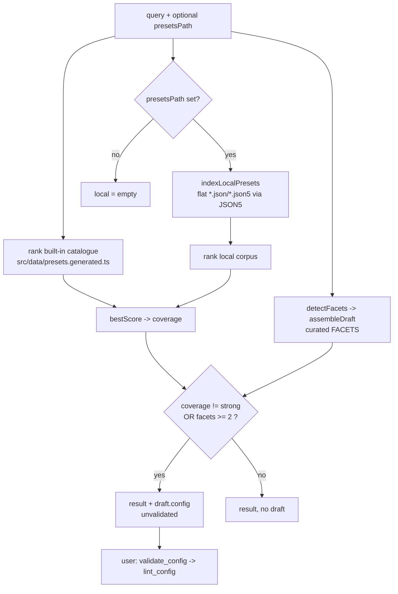

# 0005. `suggest_presets` — intent-to-preset discovery with a curated facet taxonomy

**Date:** 2026-06-26

**Status:** Accepted

## Context

The server ships a complete config-authoring toolbox, and a Renovate preset is just a Renovate config fragment, so most preset *authoring* is already covered by composing existing tools (`validate_config`, `lint_config`, `preview_custom_manager`, `resolve_config`, `explain_config`, `write_config`, `dry_run`). The one genuinely-missing capability is **discovery from intent**: the committed built-in catalogue (`src/data/presets.generated.ts`) holds ~1255 presets. "Just browse `renovate://presets`" forces the whole markdown index into the model's context and still leaves recall unreliable over that many entries — the model misses good matches and hallucinates preset names. The point of presets is *not* reinventing one that already exists upstream (or in the user's own presets repo).

`CLAUDE.md` gates surface growth: *"Surface is intentionally small … Don't grow this without a reason … not in ad-hoc additions."* ADR-0003 already named "the custom manager authoring helper idea" as a recognized-but-deferred future decision, so a discovery/authoring helper is contemplated, not off-limits. This ADR is the tracked decision (paired with a note in `.planning/ROADMAP.md`).

Two product decisions were made with the user before design:

- **Corpus** = built-in catalogue **plus** an optional local presets repo (`presetsPath`). External `github>`/`gitlab>` corpora were explicitly **excluded** for v1.
- **Gap behavior** = when no good single preset exists, the tool **also sketches an unvalidated draft** config from the recognized intent — honoring the original "ideation/creation" framing.

Constraints inherited from the project:

- **No `renovate` import in `src/`** (ADR-0001 and the project rule). The catalogue is already-committed data; local files are parsed with `JSON5` (the parse-only side of the json5/jsonc-parser split per ADR-0002 / `CLAUDE.md`).
- **Offline-and-native purity**, the same class as `preview_custom_manager`: no CLI, no network.
- **Determinism** — an MCP tool is not an LLM; ranking and drafting must be reproducible.

## Considered Options

### Axis A — surface shape: tool vs resource vs documented-workflow-only

- **A1 (chosen): a new tool.** A free-text `query` plus a synthesized, computed result (ranked scores + an assembled draft) is a parameterized query, not a document addressable by a static/template URI.
- **A2: extend the `renovate://presets` resource family.** Rejected — MCP resources are addressed by static/templated URIs (`renovate://presets/{namespace}`); free-text search does not fit that shape, and `resources/list` ≠ `tools/call` semantics.
- **A3: no new tool, just a docs guide chaining existing tools.** Rejected — leaves the ~1255-entry recall/token problem unsolved; the model still can't reliably find the right preset.

### Axis B — matching: deterministic lexical vs facet-tagged vs semantic/embedding

- **B1 (chosen): deterministic lexical search** — field-weighted (name > namespace > description > body) substring matching with a load-time IDF-style token-rarity weight and a name-overlap confidence boost, normalized to 0..1. Zero new deps, fully reproducible, snapshot-independent in its logic.
- **B2: a hand-tagged facet/capability index for matching.** Rejected as the *matching* mechanism — a taxonomy big enough to classify 1255 presets is a large, fuzzy maintenance burden. (A small taxonomy is still used for *drafting* — see Axis C.)
- **B3: embedding / semantic search.** Rejected — needs an embedding model or precomputed vectors; conflicts with offline-by-default and adds heavy deps for a recall aid.

The dominant quality risk (R1) is **scoring noise**: ~700 of the catalogue's presets are `group:*Monorepo`, so a naive overlap on "group dev deps" floods with irrelevant `group:` hits. The IDF rarity weight (computed once over the ranked pool) downweights ubiquitous tokens like `group`/`config`/`all`; field weighting + the name-overlap boost + a min-score threshold + top-N do the rest. This stays deterministic and dependency-free.

### Axis C — gap behavior: find-only vs tool-sketches-a-draft; pure-data vs hybrid facets

- **C1 (chosen): the tool also sketches an unvalidated draft**, assembled from a small **hand-maintained facet taxonomy** (`FACETS`). Each facet maps recognized intent keywords → a config fragment and/or recommended built-in presets. The draft is emitted only when coverage is not strong **or** ≥2 facets are recognized (genuine composition a single top match can't deliver); a single strongly-covered facet emits no draft. It is always marked `unvalidated` and is **never validated or merged inside the tool** — that would require the CLI / merge worker and break the instant-offline property. It composes into `validate_config` / `lint_config`, exactly as `preview_custom_manager` points at `dry_run`.
- **C2: find-only (LLM drafts in conversation).** Reasonable and more minimal, but the user explicitly chose tool-side drafting.

### Axis D — corpus breadth

- **D1 (chosen): built-in + optional local repo.** Pure offline; surfaces "you already wrote this preset" from the user's own repo.
- **D2: built-in only.** Simpler, but misses the local-repo value the user wanted.
- **D3: built-in + local + external (`github>`/`gitlab>`).** Deferred — would add network + auth (the `externalPresetFetcher` surface) and break offline-by-default. Revisit alongside roadmap item #6.

## Decision

Add a 14th tool, `suggest_presets` (`src/tools/suggestPresets.ts` → `src/lib/presetSuggester.ts`):

1. **Pure, offline, native.** No `renovate` import, no CLI, no worker, no network. Reuses the committed catalogue and `inputLimits.ts` helpers (a new `queryString` cap added).
2. **Deterministic lexical search** (B1) over the built-in catalogue and, when `presetsPath` is given, a flat local presets repo (`*.json`/`*.json5`, parsed with `JSON5`).
3. **A curated facet taxonomy** (C1) — shipped with **11 facets**: automerge (by update type), groupDevDeps, groupNonMajor, groupMonorepo, schedule, pinDigests, semanticCommits, disableMajor, separateMajor, lockfileMaintenance, labels. A drift-guard unit test asserts every facet's recommended preset resolves in the catalogue.
4. **Draft is `{ config, unvalidated, hint, facets, notes }`** — `config` is the pasteable Renovate config; the surrounding fields are metadata (callers pass `draft.config`, not the whole object, to `validate_config`). Never validated internally.
5. **External corpus deferred** (D3); built-in + local only.

## Consequences

**What this enables.** Intent → ranked existing presets (built-in + the user's own), so users stop reinventing presets and stop loading the full index into context. A composed, validatable draft for multi-intent or weakly-covered goals.

**What this costs.** A 14th tool on a deliberately small surface. A hand-maintained facet taxonomy — a new maintenance surface, deliberately bounded to ~11 high-signal facets over Renovate primitives that change rarely. Folded into the existing snapshot-drift coverage roadmap item (alongside `PACKAGE_RULE_ACTION_KEYS` and the schedule allow-lists); the drift-guard test is the safety net, and any stale recommendation is also caught downstream by `validate_config` / `lint_config`.

**What we are explicitly accepting.** Lexical search is a recall aid, not a stemmed IR engine — it favors substring/token overlap and can miss synonyms or plurals (`updates` vs `updateTypes`). That is acceptable for a discovery aid whose results the model curates. Scores across the built-in and local corpora are computed with per-corpus IDF and are not perfectly comparable; results are reported in separate arrays and that is by design.

**No `security.md` change.** `suggest_presets` reads `presetsPath` from the local filesystem only — the same trust model as the existing `repoPath` tools (`preview_custom_manager`, `read_config`), which `security.md` does not separately call out. No network, no tokens, no new env vars.

**Follow-up decisions this creates.** (a) External-preset corpus for search (needs network + auth) — a separate ADR, paired with roadmap #6. (b) Snapshot-drift CI coverage for the facet taxonomy.

## Diagram

