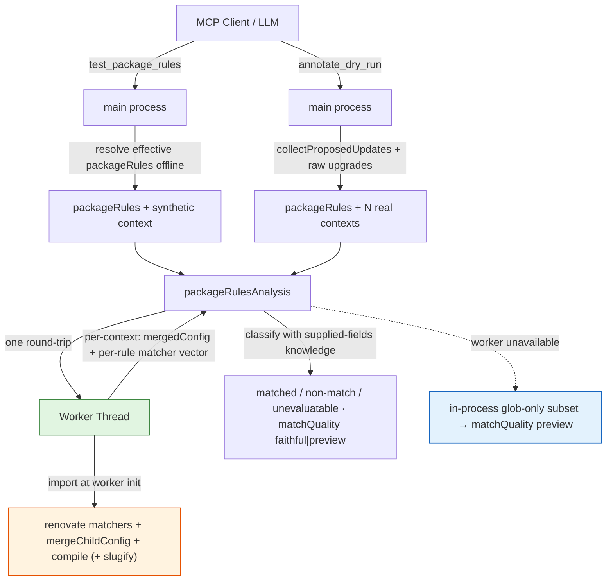

# 0006. Worker-isolated faithful `packageRules` matching for `test_package_rules` and `annotate_dry_run`

**Date:** 2026-06-28

**Status:** Accepted

## Context

Two new debugging tools answer the questions users most often ask while tuning a Renovate config:

- **`test_package_rules`** — offline "what-if": given a hypothetical dependency context (depName, datasource, manager, depType, currentValue, …) and a config, *which `packageRules` match, in what order, and what do they contribute?* Closes "why didn't my rule match?".
- **`annotate_dry_run`** — given a `dry_run` report, attribute *each* proposed update to the `packageRules` that caused it, using the real update facts already in the report. Closes "which of my rules produced these 50 updates?".

Both center on Renovate's `packageRules` matching engine, and both hit the same two-constraint collision as ADR-0001 and ADR-0004.

**Constraint 1 — the "no `renovate` import in `src/`" rule.** `CLAUDE.md` forbids importing `renovate` as a library from the main server process so the runtime stays decoupled from Renovate's internal API surface.

**Constraint 2 — faithful matching has no CLI surface and exposes no provenance.** Renovate ships only `renovate` and `renovate-config-validator` binaries; rule matching is a library concern. Reading `renovate@43.200.1`'s `dist/util/package-rules/index.js` confirms two hard facts:

1. `applyPackageRules(inputConfig)` returns *only* the merged config, and its internal `matchesRule()` returns *only* a boolean. **There is no per-rule or per-matcher provenance** — exactly the information these tools exist to surface. So calling `applyPackageRules` as a black box cannot answer "which rule matched and why".
2. The matcher set is large and version-coupled. `matchers.js` default-exports an **ordered array of 18 matcher instances**; `matchCurrentVersion` alone calls `get(versioning)` and resolves the entire Renovate versioning subsystem (npm/semver/pep440/maven/…). The loop also **mutates config mid-iteration** — `removeMatchers` + `groupSlug` + enable/skip + `overrideDatasource`/`overrideDepName`/`overridePackageName` (via `compile`) + `mergeChildConfig` — so a later rule's match can depend on an earlier rule's override.

**The fidelity subtlety.** A matcher returns `false` *identically* for "the field was supplied and didn't match" and "the field is absent". Only a layer that knows what the caller actually supplied can tell a real non-match from an unevaluatable one. And five matchers (`matchUpdateTypes`, `matchNewValue`, `matchCurrentVersion`, `matchCurrentAge`, `matchConfidence`) need post-lookup context that an offline what-if simply doesn't have — `matchConfidence` always throws `MISSING_API_CREDENTIALS` offline.

There is direct precedent: **ADR-0001** (migration) and **ADR-0004** (faithful merge) both isolate a renovate library import inside a `node:worker_threads` worker with a faithful/preview fallback and a drift-sentinel test. This is the same shape.

## Considered Options

### Option 1: Reimplement the 18 matchers offline in `src/`

Port each matcher's logic (glob-vs-regex disambiguation, `satisfiesDateRange`, the versioning subsystem, async JSONata) into our own code, reading snapshots of Renovate's behavior.

**Pros:** stays offline and instant; no worker; no cold start.

**Cons:** a large hand-maintained surface that re-derives Renovate internals — the precise coupling the "no `renovate` import" rule forbids. `matchCurrentVersion` alone pulls in the whole versioning subsystem. The worst failure mode is **confidently-wrong "faithful" output** when our reimplementation drifts from a Renovate bump. Rejected for the same reason as ADR-0004 Option 1.

### Option 2: Shell out to `renovate --dry-run` and parse

**Cons:** `test_package_rules` is an offline what-if with no repo to run against; for `annotate_dry_run` the report already exists, so re-running is redundant and heavyweight. Wrong shape, same rejection as ADR-0001/0004's shell-out option.

### Option 3: Black-box-call `applyPackageRules` in a worker

Import the real `applyPackageRules` in a worker and return its merged config.

**Cons:** gives a faithful *merge* but **no provenance** — it cannot say which rule matched or why, which is the entire feature. Insufficient alone.

### Option 4: Worker-isolated real matchers + loop replication (chosen)

A new dedicated worker imports Renovate's real `matchers` array (plus `mergeChildConfig`, `compile`, `slugify`) and **replicates `applyPackageRules`' loop** so it can capture each rule's per-matcher `null | true | false | threw` vector *while* reproducing Renovate's exact merge (override\* mid-loop + `mergeChildConfig`). A shared analysis lib classifies each result using the worker's vector **plus** which fields the caller supplied. `annotate_dry_run` feeds real report facts; `test_package_rules` feeds synthetic facts. `matchQuality` is `"faithful"` when the worker ran, `"preview"` (a thin in-process glob-only subset, disclaimer → `dry_run`) when it didn't — mirroring `resolve_config`/`explain_config`.

**Pros:**
- The only option that delivers the provenance the feature needs *and* faithful merge semantics, without importing `renovate` into the main process.
- Loop replication is trivial against the real `matchers` array but impossible to do faithfully against a hand-rolled one — so faithfulness is structurally guaranteed and guarded by a parity test.
- Reuses the established ADR-0001/0004 worker pattern (terminable, stdio-isolated, single round-trip, 30 s budget, graceful fallback). `annotate_dry_run` batches all updates into one round-trip = one cold start.

**Cons:**
- A **third** worker-isolated `renovate` import; matching semantics are now version-coupled to the installed Renovate.
- Offline gaps are real: `matchConfidence` is never evaluatable offline; computed fields absent from synthetic input or the report shape are reported as *unevaluatable*, not `false`.

## Decision

**We will use Option 4.** New worker pair `src/lib/packageRulesWorker.ts` + `src/lib/packageRulesWorkerImpl.ts`, mirroring `mergeWorker`. It is a **new dedicated worker, not an extension of `mergeWorker`** — `packageRules` evaluation is orthogonal to preset merging and is never a sub-step of a merge fold; multiplexing would entangle two unrelated timeout/lifecycle concerns. The worker **replicates** `applyPackageRules`' loop (it does not import it as a black box) because the boolean-only `matchesRule` exposes no provenance; replication is the only way to capture the per-matcher vector while reproducing Renovate's exact merge.

Deciding factors:

1. **It is the only option that closes the feature without violating the isolation rule** — same logic as ADR-0004 Option 2: the worker is the sandbox boundary, the main process keeps zero `import 'renovate/…'`.
2. **Honest about its gaps.** Unevaluatable matchers are surfaced as such, never silently coerced to non-matches; `matchConfidence` is documented as offline-impossible; legacy matcher keys (`matchPackagePatterns`/`matchPackagePrefixes`/`paths`) are warned about and the user is pointed at `migrate_config` (consistent with the `lint_config` → `migrate_config` composition; we do **not** auto-migrate, keeping the worker single-purpose).
3. **The cost profile is acceptable and bounded** — one cold-load per call in a terminable worker, `annotate_dry_run` batches N updates into one round-trip, and the preview fallback keeps the tools resilient.

This narrows the ADR-0001/0004 carve-out further: a **third** worker-isolated `renovate` import now exists. The rule survives in substance; any future such tool still needs its own ADR.

## Consequences

**Easier:**
- Users get faithful, per-rule attribution for both the offline what-if (`test_package_rules`) and real dry-run output (`annotate_dry_run`), including a dead-rule signal (`rulesNeverMatched`).

**Harder:**
- Matching semantics are version-coupled to the installed Renovate. Mitigated by a **matcher-registry drift sentinel** (asserts the array length `=== 18` and the ordered class names, failing loudly in PR CI on a Renovate bump that adds/reorders/renames a matcher), a **parity oracle** (asserts the worker's `mergedConfig` deep-equals a direct `applyPackageRules()` call for matchConfidence-free configs), and the existing nightly real-Renovate workflow.
- The `false`-vs-missing-field disambiguation depends on a small hand-maintained matcher→requiredFields map in `packageRulesAnalysis.ts` — a bounded allow-list (the project's accepted pattern, far smaller than reimplementing matchers), snapshot-tested and tied to the drift sentinel.

**Tradeoffs accepted:**
- Further rule-erosion: a third worker-isolated import. Each future case still requires its own ADR.
- `matchConfidence` rules and computed-context matchers are reported as unevaluatable offline rather than evaluated — an honest limitation, surfaced in the tool output and `docs/tools.md`.

**Follow-ups (completed with this decision):**
- `src/lib/packageRulesWorker.ts` + `src/lib/packageRulesWorkerImpl.ts` (worker + protocol), mirroring `mergeWorker`.
- `src/lib/packageRulesAnalysis.ts` (shared classification + preview fallback + legacy-key warning).
- `src/tools/testPackageRules.ts`, `src/tools/annotateDryRun.ts`; `identityKey` exported from `src/lib/dryRunDiff.ts`; both tools wired in `src/index.ts` + `BASE_INSTRUCTIONS`.
- `vitest.config.ts` gains `RENOVATE_MCP_PACKAGE_RULES_WORKER_ENTRY`.
- `CLAUDE.md` Architecture carve-out amended to name `packageRulesWorker.ts` and link this ADR; docs (`docs/tools.md`, `docs/architecture.md`, `docs/operations.md`, `README.md`) updated.

## Diagram

